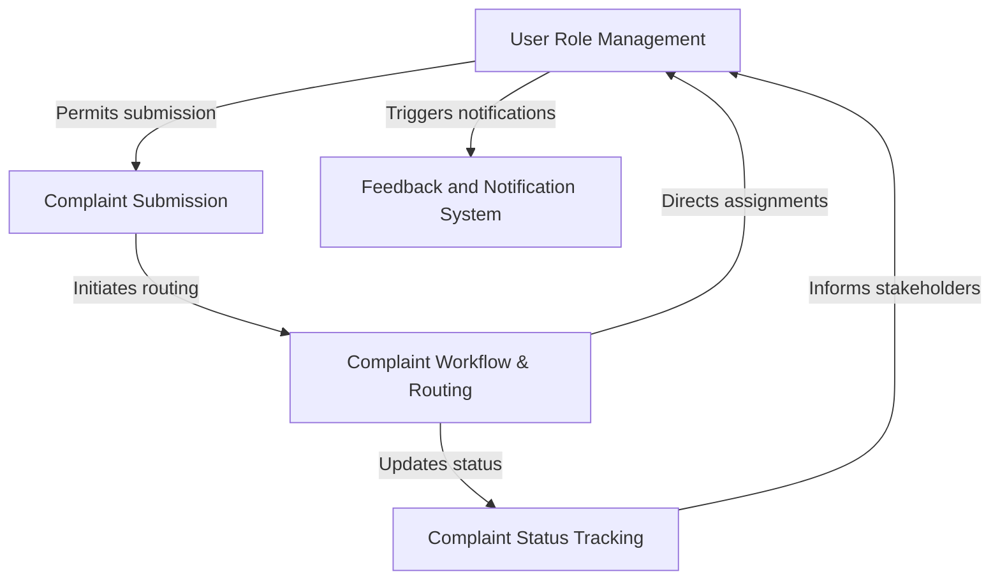
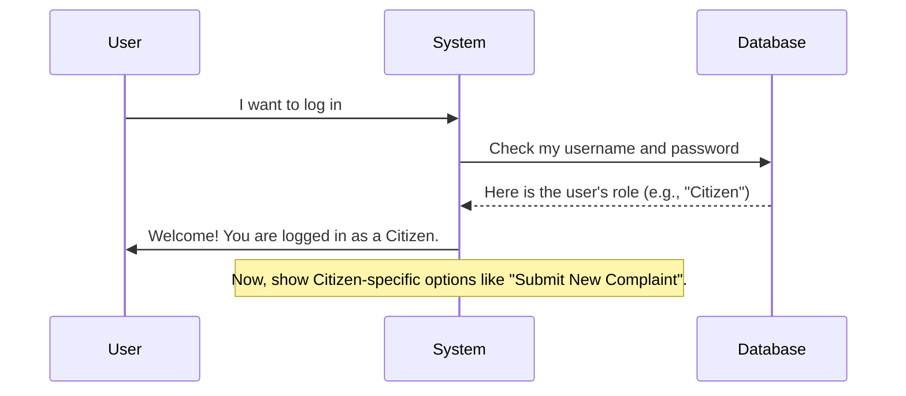
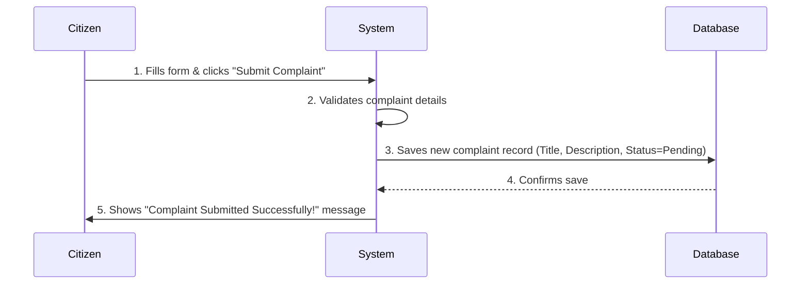
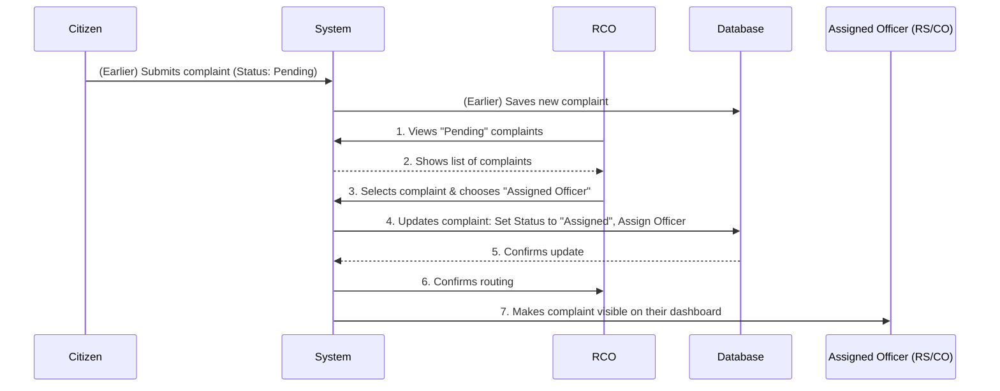
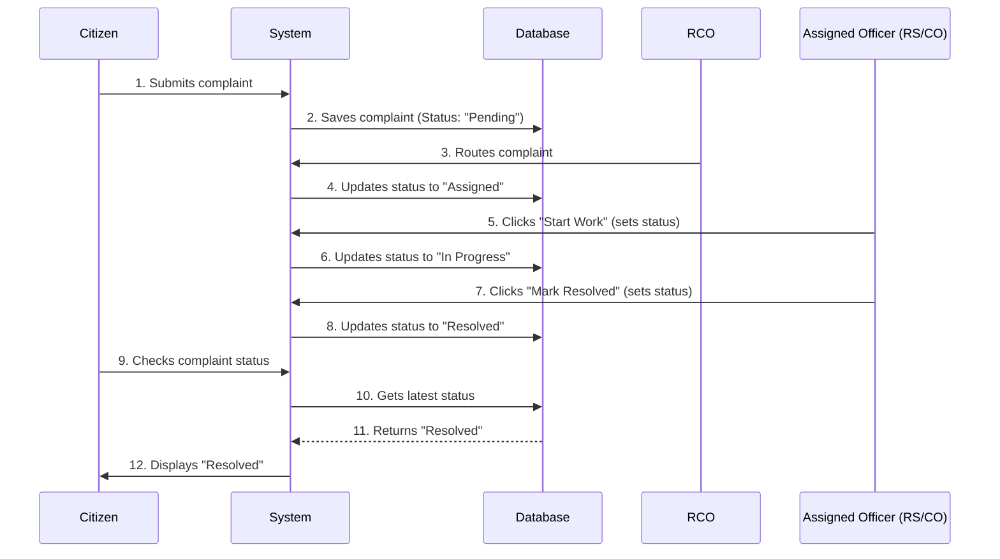
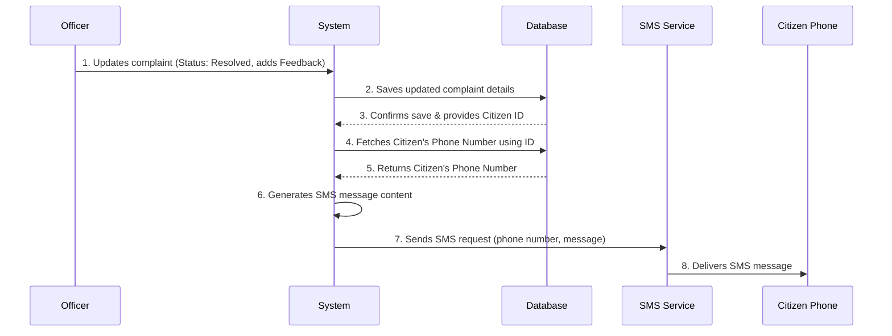

# Tutorial: Complaint_project

This project is an *Automated Complaint Management System* designed to help citizens report community issues easily. Once a complaint is submitted, the system ensures it reaches the **right authority** quickly for **resolution**. It also keeps the citizen *informed* about the complaint's progress and final feedback through **SMS notifications**.


## Visual Overview



## Chapters

1. [User Role Management
](01_user_role_management_.md)
2. [Complaint Submission
](02_complaint_submission_.md)
3. [Complaint Workflow & Routing
](03_complaint_workflow___routing_.md)
4. [Complaint Status Tracking
](04_complaint_status_tracking_.md)
5. [Feedback and Notification System
](05_feedback_and_notification_system_.md)

# Chapter 1: User Role Management

Welcome to the first chapter of our tutorial on the Automated Complaint Management System! In this chapter, we're going to explore a fundamental concept called "User Role Management." Don't worry if that sounds technical; we'll break it down into simple, easy-to-understand pieces.

### What Problem Are We Solving?

Imagine a big office where everyone just walks in and does whatever they want. Some people might try to do tasks they're not trained for, or accidentally mess up important files. This would be chaotic, right?

Our Automated Complaint Management System is like that office. We need a way to make sure that:
1.  **Only the right people can do specific tasks.** For example, only a specific officer should be able to assign a complaint to another department, and only a citizen should be able to submit a complaint.
2.  **Everyone knows their job.** Each person interacting with the system should have clear responsibilities.

This is exactly what "User Role Management" helps us with! It's about giving different users different "job titles" (roles) within our system, and each job title comes with specific tasks they are allowed to perform.

### What is a User Role?

Think of a "User Role" as a job title in our system. Just like in a company, where a Manager has different responsibilities than an Employee, in our system, a "Citizen" user has different abilities than a "Regional Commissioner Officer."

Assigning roles helps the system know who you are and what you're allowed to do. This keeps everything organized, secure, and ensures tasks are handled by the right people.

### Our System's Job Titles (User Roles)

Our Automated Complaint Management System has four main "job titles" or user roles:

| Role Name                   | Main Responsibilities                                                                                   |
| :-------------------------- | :------------------------------------------------------------------------------------------------------ |
| **Citizen**                 | Can register themselves, **submit new complaints**, and manage (edit/delete) their *own* complaints.    |
| **Regional Commissioner Officer (RCO)** | A supervisor role. Can **register other officers** (RS and CO), receive complaints, and **forward complaints** to RS/CO. |
| **Regional Secretary (RS)** | An officer responsible for handling complaints forwarded by the RCO.                                    |
| **Complaint Officer (CO)**  | Another officer responsible for handling complaints forwarded by the RCO.                               |

As you can see, each role has very specific duties. A Citizen cannot register a new officer, and an RCO cannot submit a complaint as a Citizen. This strict separation helps our system run smoothly and securely.

### How Does the System Know My Role?

When you log into the system, it first checks who you are. Then, it looks up your assigned "role." Based on this role, the system decides which actions you are allowed to perform and which parts of the system you can access.

Let's imagine how this process works behind the scenes when a user tries to access the system:



In this diagram:
*   The `User` is you, trying to use the system.
*   The `System` is our Complaint Management Application.
*   The `Database` is where all the user information, including their roles, is stored securely.

When you log in, the system asks the database, "What's this user's role?" The database replies, for example, "This user is a Citizen." Then, the system tailors what you see and what you can do based on that information.

### A Peek at the Code (Conceptual)

While we don't have a specific code snippet from `README.md` that *shows* role management, conceptually, the system might have very simple checks like this when you try to do something:

```python
# Imagine 'current_user' is the person logged in
# And 'current_user.role' tells us their job title

if current_user.role == "Citizen":
    # If the user is a Citizen, allow them to submit complaints
    allow_submit_complaint_form()
    hide_officer_registration_button()
elif current_user.role == "Regional Commissioner Officer":
    # If the user is an RCO, allow them to register other officers
    allow_register_officer_form()
    hide_submit_complaint_button()
else:
    # For other roles, show options relevant to them
    pass # ... more role-specific logic here
```
This simplified code snippet shows how the system might use an `if-else if` structure to check the `current_user.role`. Depending on the role, it decides which features or actions should be made available or hidden. This ensures that a Citizen only sees options to submit complaints, while an RCO sees options to manage officers or forward complaints.

This simple check is at the heart of how User Role Management works, making sure everyone has the right access and responsibility

Show Rendered
# Chapter 2: Complaint Submission

Welcome back! In our [first chapter on User Role Management](01_user_role_management_.md), we learned about the different "job titles" people have in our Automated Complaint Management System. We found out that only specific roles can do specific things. One very important role we talked about was the **Citizen**.

This chapter is all about the **Complaint Submission** process, which is the main task a Citizen user performs.

### What Problem Are We Solving?

Imagine you're walking down your street and you notice a big, overflowing garbage bin, or maybe a streetlight that's been broken for days. These are problems that affect your community, and they need to be fixed! But how do you report them to the right people so something can be done?

Traditionally, you might have to call many different offices, write letters, or not know who to contact at all. This can be frustrating and slow down problem-solving.

Our Automated Complaint Management System solves this by providing a simple, organized way for citizens to report these issues. The **Complaint Submission** feature is the key tool for this! It's like having a special mailbox where you can easily drop off your concerns directly to the authorities.

### What is a Complaint Submission?

Think of "Complaint Submission" as the act of formally telling the system about an issue. It's similar to filling out an online form or writing a detailed email to an office. When you "submit" a complaint, you are providing all the necessary information about the problem you want to report.

Here's what happens when a complaint is successfully submitted:

1.  **It's Officially Logged:** The system records your complaint with a unique ID, like giving it a tracking number.
2.  **It Enters the Workflow:** The complaint immediately becomes visible to the right authorities (like the officers we mentioned in Chapter 1) so they can start reviewing and taking action.

This is the very first step for any community-related problem to enter our management system.

### Who Can Submit a Complaint? (And Why it Matters)

Based on what we learned in [User Role Management](01_user_role_management_.md), only users with the **Citizen** role are allowed to submit new complaints. This is important for a few reasons:

*   **Organization:** It keeps the system clean and clear, ensuring that only affected community members report issues.
*   **Accountability:** Each complaint is linked to a citizen, allowing for feedback to be sent directly to them later.
*   **Security:** It prevents unauthorized people from flooding the system with fake or irrelevant complaints.

### How a Citizen Submits a Complaint

When a Citizen logs into the system, they will see options specifically for them. As shown in the `README.md` file, the Citizen user account often looks like this:


On this screen, or a similar one, a Citizen would typically find a button or a link to "Submit New Complaint" or "Report an Issue."

Let's imagine the steps a Citizen takes:

1.  **Log in:** The Citizen uses their username and password to enter the system.
2.  **Navigate to Complaint Form:** They click on a "Submit Complaint" button.
3.  **Fill Out the Form:** They provide details about the issue. This form usually asks for:
    *   **Complaint Title:** A short summary (e.g., "Broken Streetlight on Main Street").
    *   **Complaint Description:** More details about the problem (e.g., "The streetlight near 123 Main Street has been flickering and is now completely out. It's very dark at night.").
    *   **Location:** Where exactly the problem is (e.g., "Main Street, near the library").
    *   **Type of Issue:** Sometimes a category (e.g., "Infrastructure," "Environment," "Public Safety").
    *   **Optional Attachments:** Sometimes you can upload photos to show the problem.
4.  **Submit:** The Citizen clicks a "Submit" or "Send" button.

Once submitted, the complaint's initial status is usually "Pending," as seen in the `README.md` example:


### What Happens "Under the Hood" When You Submit?

Let's peek behind the curtain to see what the system does when a Citizen clicks that "Submit" button.

#### The Journey of a Complaint (Non-Code Walkthrough)

1.  **Citizen Action:** You, as a Citizen, fill out the complaint form on your computer or phone and click "Submit."
2.  **System Receives:** The system (our Complaint Management Application) receives all the information you typed into the form.
3.  **Data Validation:** The system quickly checks if all the required fields are filled and if the information looks reasonable (e.g., is the location provided?).
4.  **Complaint Creation:** If everything looks good, the system creates a new "Complaint" record. It automatically adds things like the current date and time, and sets the initial status to "Pending."
5.  **Storage:** This new complaint record, with all its details, is then saved into the system's database. The database is like a digital filing cabinet where all important information is kept organized and safe.
6.  **Confirmation:** The system usually shows you a message saying your complaint was submitted successfully.

Here's a simple diagram showing this flow:



In this diagram:
*   The `Citizen` is the user initiating the action.
*   The `System` is our Complaint Management Application, processing the request.
*   The `Database` is where all the complaint data is stored.

#### A Peek at the Code (Conceptual)

While the full code for handling web forms and databases can be complex, let's look at a super simplified idea of how the system might process a new complaint once it receives the details:

```python
# Imagine this is part of the system's logic for handling a submission

def handle_new_complaint_submission(title, description, location, citizen_id):
    """
    This function conceptually processes a new complaint.
    """
    # Step 1: Create a new complaint record with the provided details
    new_complaint = {
        "title": title,
        "description": description,
        "location": location,
        "submitted_by_citizen_id": citizen_id,
        "status": "Pending",  # This is the initial status
        "submission_date": "2023-10-27" # Current date
    }

    # Step 2: Save this complaint to our storage (e.g., a database)
    # (In a real system, this would interact with a database)
    print(f"Complaint '{new_complaint['title']}' from Citizen ID {citizen_id} saved.")

    # Step 3: Indicate success
    return True

# Example of how this might be called when a citizen submits a form
# imagine 'form_data' comes from the user's input
form_data = {
    "title": "Overflowing Garbage Bin",
    "description": "Garbage bin at park entrance is overflowing, attracting pests.",
    "location": "Central Park Entrance",
    "citizen_id": 123
}

if handle_new_complaint_submission(
    form_data["title"],
    form_data["description"],
    form_data["location"],
    form_data["citizen_id"]
):
    print("Complaint successfully submitted!")
else:
    print("Failed to submit complaint.")

```
This simplified `handle_new_complaint_submission` function shows the core idea: it takes the details provided by the citizen, creates a new record for the complaint, automatically sets its status to "Pending," and then "saves" it. In a real system, this "saving" would involve writing the data to a database. The `README.md` mentions that "The citizen is responsible for self-registration... After registering, they can submit complaints... For a certain period of time, its status remains marked as “Pending.”" This aligns perfectly with the `status: "Pending"` line in our conceptual code.

The successful submission of a complaint is the starting point for it to be managed and eventually resolved by the appropriate authorities, as mentioned in the `README.md` about issues reaching responsible authorities promptly.

# Chapter 3: Complaint Workflow & Routing

Welcome back to our journey through the Automated Complaint Management System! In our [previous chapter on Complaint Submission](02_complaint_submission_.md), we learned how a citizen can successfully report an issue, and how the system officially logs it, usually marking its initial status as "Pending."

Now that a complaint is *in* the system, what happens next? It can't just sit there forever, right? This is where **Complaint Workflow & Routing** comes into play.

### What Problem Are We Solving?

Imagine our complaint system is like a busy post office. Letters (complaints) arrive all the time. If they just piled up in a corner, no one would ever get their mail! We need a way to:

1.  **Move complaints along:** Ensure issues don't get stuck and are actively worked on.
2.  **Send complaints to the right person:** Make sure the specific problem (like a broken streetlight or an overflowing bin) goes to the officer who is best equipped to handle it. Sending a "broken streetlight" complaint to the "garbage collection" officer wouldn't make sense!

**Complaint Workflow & Routing** is our system's way of being that "smart post office" – it guides each complaint through the right steps and directs it to the most appropriate person.

### What is Complaint Workflow & Routing?

Let's break down these two terms:

*   **Complaint Workflow:** Think of this as the *path* a complaint takes. It's the series of steps a complaint goes through, from being "Pending" to being "Resolved." It defines the allowed movement of a complaint from one stage to another.
*   **Complaint Routing:** This is the *act of directing* a complaint to the correct person or department. It’s like a traffic controller for issues, making sure they go to the right officer (like a Regional Secretary or a Complaint Officer) to be addressed.

Together, they ensure that once a complaint is submitted, it quickly finds its way to the responsible party, speeding up the process of getting problems fixed!

### Who is Responsible for Routing?

In our system, after a citizen submits a complaint, it first lands in the hands of the **Regional Commissioner Officer (RCO)**. Remember the RCO from [Chapter 1: User Role Management](01_user_role_management_.md)? Their role is supervisory, and a key part of that is receiving complaints and deciding where they should go next.

The RCO acts as the "dispatcher" or "router." They review the new "Pending" complaints and decide whether to send them to a **Regional Secretary (RS)** or a **Complaint Officer (CO)**. This decision might be based on:
*   **Type of issue:** e.g., infrastructure, sanitation, public safety.
*   **Jurisdiction:** Which officer handles what area or type of problem.

### How Does the RCO Route a Complaint? (Solving Our Use Case)

Let's imagine an RCO logs into the system. They would see a list of newly submitted complaints with a "Pending" status. For each complaint, they would have an option to "Forward" or "Assign" it to either an RS or a CO.

Here's a simplified step-by-step example:

1.  **RCO Logs In:** The Regional Commissioner Officer logs into their account.
2.  **Views New Complaints:** The RCO sees a list of complaints that citizens have submitted, all currently marked as "Pending."
    *   *Example Complaint:* "Broken Streetlight on Main Street"
3.  **Reviews Complaint Details:** The RCO clicks on a complaint to read its description, location, and type of issue.
4.  **Decides on Officer:** Based on the complaint details (e.g., "Broken Streetlight" is an infrastructure issue usually handled by the Regional Secretary), the RCO decides which officer should handle it.
5.  **Routes the Complaint:** The RCO selects the chosen officer (e.g., "Regional Secretary Jane Doe") from a dropdown menu and clicks a "Route Complaint" or "Assign" button.

Once the RCO routes it, the complaint's status will change from "Pending" to something like "Assigned" or "In Progress," and it will now be visible to the assigned officer.

### What Happens "Under the Hood" When a Complaint is Routed?

Let's look at what the system does behind the scenes when an RCO routes a complaint.

#### The Journey of a Routed Complaint (Non-Code Walkthrough)

1.  **RCO Action:** The Regional Commissioner Officer selects a "Pending" complaint and chooses an RS or CO to assign it to, then clicks "Route."
2.  **System Receives Request:** Our Complaint Management Application receives the request from the RCO, including the complaint's ID and the chosen officer's ID.
3.  **Update Complaint Record:** The system goes to its storage (database) and finds that specific complaint. It then updates two important pieces of information:
    *   It changes the complaint's **status** from "Pending" to "Assigned" (or "In Progress").
    *   It records *which* officer (RS or CO) has been **assigned** to handle this complaint.
4.  **Confirmation & Visibility:** The system confirms the update. Now, the complaint appears on the assigned officer's dashboard, ready for them to take action. The original RCO can also see that it's been assigned.

Here's a simple diagram showing this flow:



In this diagram:
*   The `Citizen` is the one who originally submitted the complaint.
*   The `System` is our application managing everything.
*   The `RCO` is the Regional Commissioner Officer, doing the routing.
*   The `Database` is where all the complaint details are stored and updated.
*   The `Assigned Officer (RS/CO)` is the Regional Secretary or Complaint Officer who will now work on the complaint.

#### A Peek at the Code (Conceptual)

While the full code for handling this interaction is part of the larger project, let's look at a very simplified idea of how the system might update a complaint's routing information once the RCO makes a decision:

```python
# Imagine this function is called when an RCO routes a complaint

def route_complaint(complaint_id, assigned_officer_id):
    """
    Conceptually routes a complaint to a specific officer.
    In a real system, this would interact with a database.
    """
    print(f"--- Routing Complaint {complaint_id} ---")

    # Step 1: Find the complaint in our 'database' (conceptual list)
    # (This is a simplified representation of fetching data)
    complaint_data = get_complaint_from_database(complaint_id)

    if complaint_data:
        # Step 2: Update the complaint's status and assigned officer
        complaint_data["status"] = "Assigned"
        complaint_data["assigned_to_officer_id"] = assigned_officer_id

        # Step 3: Save the updated complaint back to the 'database'
        # (Again, simplified - actual database save would be more complex)
        update_complaint_in_database(complaint_id, complaint_data)

        print(f"Complaint '{complaint_data['title']}' (ID: {complaint_id})")
        print(f"Status changed to: '{complaint_data['status']}'")
        print(f"Assigned to Officer ID: {assigned_officer_id}")
        return True
    else:
        print(f"Error: Complaint with ID {complaint_id} not found.")
        return False

# --- Helper functions (conceptual, not actual database code) ---
_mock_complaints_db = {
    101: {"title": "Broken Streetlight", "status": "Pending", "assigned_to_officer_id": None},
    102: {"title": "Overflowing Bin", "status": "Pending", "assigned_to_officer_id": None},
}

def get_complaint_from_database(comp_id):
    return _mock_complaints_db.get(comp_id)

def update_complaint_in_database(comp_id, data):
    _mock_complaints_db[comp_id] = data
# --- End Helper Functions ---

# Example: RCO routes complaint ID 101 to Officer ID 50 (who is an RS or CO)
rco_assigned_officer_id = 50
if route_complaint(101, rco_assigned_officer_id):
    print("\nComplaint successfully routed!")
else:
    print("\nFailed to route complaint.")

# Example: Check the 'database' after routing
print("\n--- Current 'Database' State ---")
print(_mock_complaints_db)

```
This `route_complaint` function gives you a conceptual idea of how the system processes the RCO's action. It takes the complaint's ID and the ID of the officer it needs to be assigned to. Inside, it `gets` the complaint's current information, `updates` its `status` and `assigned_to_officer_id`, and then `saves` these changes. This simple action is at the heart of the "routing" process, making sure the complaint gets to the right desk. The `README.md` states, "the RCO receives complaints submitted by citizens and has the authority to forward these complaints to the appropriate RS or CO for resolution," which perfectly aligns with this routing mechanism.
# Chapter 4: Complaint Status Tracking

Welcome back to our tutorial on the Automated Complaint Management System! In our [previous chapter on Complaint Workflow & Routing](03_complaint_workflow___routing_.md), we learned how a complaint, once submitted by a citizen, gets routed by a Regional Commissioner Officer (RCO) to the right officer for action.

Now that a complaint is submitted and assigned, how do we know what's happening with it? Is someone working on it? Has it been fixed? This is where **Complaint Status Tracking** comes in!

### What Problem Are We Solving?

Imagine you've sent an important package to a friend. After you drop it off, you don't just forget about it, right? You probably want to know:
*   Has it been shipped?
*   Is it currently on its way?
*   Has it been delivered?

You would use a tracking number to find out!

Our Automated Complaint Management System works in a very similar way. When a citizen submits a complaint (like reporting a broken streetlight), they want to know its progress. Has it been seen? Has it been assigned? Is someone working on it? Is it fixed?

**Complaint Status Tracking** solves this by giving every complaint its own "tracking number" (though it's more of a "status label"). It allows both citizens and officers to see exactly where a complaint stands in its journey from being reported to being resolved. This provides crucial transparency and helps everyone stay informed.

### What is a Complaint Status?

A "Complaint Status" is simply a label that tells you the current state or stage of a complaint. It's like the different steps a package goes through.

Here are some common statuses a complaint might have in our system:

| Status Name       | What it Means                                                                        | Who Sees It                                    | Who Might Set It                 |
| :---------------- | :----------------------------------------------------------------------------------- | :--------------------------------------------- | :------------------------------- |
| **Pending**       | The complaint has just been submitted and is waiting for review/assignment.          | Citizen, RCO                                   | System (automatically on submission) |
| **Assigned**      | The RCO has reviewed the complaint and sent it to a specific RS or CO for action.    | Citizen, RCO, Assigned Officer                 | RCO                              |
| **In Progress**   | The assigned officer is actively working on the complaint.                           | Citizen, RCO, Assigned Officer                 | Assigned Officer (RS/CO)         |
| **Resolved**      | The problem reported in the complaint has been fixed or addressed.                   | Citizen, RCO, Assigned Officer                 | Assigned Officer (RS/CO)         |
| **Closed**        | The complaint is fully processed and no further action is needed (often after resolved and feedback). | Citizen, RCO, Assigned Officer                 | RCO or Assigned Officer          |

These statuses help everyone understand the "story" of the complaint as it moves through the system.

### How Complaint Status Tracking Works in Our System

Let's see how different users interact with and use complaint statuses.

#### For the Citizen: Staying Informed

When a citizen logs into their account, they can see a list of all the complaints they've submitted. Next to each complaint, they will see its current status. This is exactly what the `README.md` shows, where a newly submitted complaint is "Pending":


A citizen cannot *change* the status, but they can always *see* it. This helps them monitor the progress without needing to call or email.

#### For the Officers (RCO, RS, CO): Managing Progress

Officers are the ones who change the status of a complaint as they work on it.

*   **Regional Commissioner Officer (RCO):** As we learned in [Chapter 3: Complaint Workflow & Routing](03_complaint_workflow___routing_.md), the RCO initially changes a complaint's status from "Pending" to "Assigned" when they forward it to an RS or CO.
*   **Regional Secretary (RS) / Complaint Officer (CO):** Once a complaint is "Assigned" to an RS or CO, they will take over. As they begin working, they might change the status to "In Progress." After they fix the issue, they will update the status to "Resolved."

This allows officers to clearly manage their workload and indicate the progress of each issue.

### What Happens "Under the Hood" When a Status is Updated?

Let's look at what the system does behind the scenes when an officer updates a complaint's status.

#### The Journey of a Status Update (Non-Code Walkthrough)

1.  **Citizen Submits:** (From [Chapter 2: Complaint Submission](02_complaint_submission_.md)) A citizen creates a new complaint. The system automatically sets its status to "Pending" and saves it.
2.  **RCO Routes:** (From [Chapter 3: Complaint Workflow & Routing](03_complaint_workflow___routing_.md)) The RCO reviews the "Pending" complaint and assigns it to an RS/CO. The system updates the status to "Assigned."
3.  **Officer Takes Action:** The assigned RS or CO logs in, sees the "Assigned" complaint, and starts working on it. They click a button to change its status to "In Progress."
4.  **System Receives Update:** Our Complaint Management Application receives this request, knowing which complaint and what new status.
5.  **Database Update:** The system finds the complaint in its storage (database) and updates just the "status" part of that complaint's record.
6.  **Officer Resolves:** Later, after fixing the problem, the officer changes the status to "Resolved." The system again updates the database.
7.  **Citizen Views:** When the citizen checks their account, the system fetches the latest status from the database and displays it.

Here's a simplified diagram showing this flow:



In this diagram, you can see how the `System` and `Database` work together to keep the complaint's `Status` up-to-date as different users interact with it.

#### A Peek at the Code (Conceptual)

At its core, changing a complaint's status means updating a piece of information stored in the system's database. Let's imagine a very simple function that handles this:

```python
# Imagine this function is part of the system's logic for officers

def update_complaint_status(complaint_id, new_status):
    """
    Conceptually updates the status of a specific complaint.
    In a real system, this would interact with a database.
    """
    print(f"--- Updating Status for Complaint {complaint_id} ---")

    # Step 1: Find the complaint in our 'database' (conceptual list)
    # (This is a simplified representation of fetching data)
    complaint_data = _mock_complaints_db.get(complaint_id)

    if complaint_data:
        # Step 2: Update only the 'status' field
        old_status = complaint_data["status"]
        complaint_data["status"] = new_status

        # Step 3: Save the updated complaint back to the 'database'
        _mock_complaints_db[complaint_id] = complaint_data

        print(f"Status changed from '{old_status}' to '{new_status}'")
        return True
    else:
        print(f"Error: Complaint with ID {complaint_id} not found.")
        return False

# --- Helper functions (conceptual, same as Chapter 3) ---
_mock_complaints_db = {
    101: {"title": "Broken Streetlight", "status": "Pending", "assigned_to_officer_id": None},
}

# Example: Citizen submits (Status is "Pending" initially, as per README.md)
# Example: RCO routes (Status becomes "Assigned")
update_complaint_status(101, "Assigned")

# Example: An Assigned Officer starts working on it
update_complaint_status(101, "In Progress")

# Example: The Assigned Officer resolves the issue
update_complaint_status(101, "Resolved")

print("\n--- Current 'Database' State ---")
print(_mock_complaints_db)

```
This `update_complaint_status` function shows how simple it is conceptually. It takes a `complaint_id` and the `new_status`. It then finds that complaint and changes its `status` field. The "saving" step (where `_mock_complaints_db[complaint_id] = complaint_data` happens) is where the change is stored. This small action is what powers the entire "Complaint Status Tracking" feature, allowing both citizens and officers to know the exact progress of any issue.
# Chapter 5: Feedback and Notification System

Welcome to the final chapter of our tutorial on the Automated Complaint Management System! In our [previous chapter on Complaint Status Tracking](04_complaint_status_tracking_.md), we learned how complaints move through different stages and how everyone can see their current status, from "Pending" to "Resolved."

But once a complaint is "Resolved," how does the citizen who reported it actually know? Do they have to keep checking the system? What if they want to know *why* it was resolved or get more details? This is exactly where the **Feedback and Notification System** comes in!

### What Problem Are We Solving?

Imagine you reported that overflowing garbage bin, and now it's been cleaned up. You might visit the park later and see it's fixed. That's great! But wouldn't it be even better if someone just *told* you, "Hey, that garbage bin you reported? It's all clean now!"

Our system aims to be super helpful and transparent. The **Feedback and Notification System** solves these problems:

1.  **Keeps Citizens Informed Automatically:** Citizens don't need to constantly log in and check. The system tells them directly when there's an update.
2.  **Closes the Loop:** It provides a clear confirmation that their reported issue has been addressed, fostering trust in the system and the authorities.
3.  **Provides Details:** Officers can send specific messages (feedback) about what was done, not just a status change.

It's like having a dedicated, automated messenger service for every complaint!

### What is a Feedback and Notification System?

In our system, the "Feedback and Notification System" is a core component that acts like a smart assistant. When something important happens to a complaint (especially when an officer provides an update or resolves it), this system automatically sends a message to the citizen who submitted that complaint.

The most important things to remember are:

*   **It's Automated:** Officers don't manually send individual messages. When they update the complaint's details or status, the system handles the notification automatically.
*   **It Uses SMS:** For quick and direct communication, these notifications are sent via SMS (text message) to the phone number the citizen registered with. This makes sure the message reaches them quickly, wherever they are.
*   **It Delivers "Feedback":** This isn't just a status update. Officers can add specific notes or details (the "feedback") about what action was taken, and this information is included in the SMS.

### Who Provides Feedback and Triggers Notifications?

Any authorized officer can provide feedback that triggers a notification:

*   **Regional Commissioner Officer (RCO):** As a supervisor, an RCO might provide feedback if they directly resolve an issue or if they're following up on a routed complaint.
*   **Regional Secretary (RS):** If an RS is assigned a complaint and resolves it, they will provide feedback.
*   **Complaint Officer (CO):** Similar to the RS, a CO will provide feedback once they've addressed the complaint assigned to them.

The key is that once *any* of these officers provides an update or feedback on a complaint, the notification system immediately springs into action.

### How the System Notifies a Citizen (Solving Our Use Case)

Let's imagine the scenario where an assigned officer resolves a complaint and provides feedback.

1.  **Officer Resolves Complaint:** An officer (RS or CO) assigned to the "Broken Streetlight on Main Street" complaint successfully repairs the light. They log into the system.
2.  **Officer Provides Feedback:** On the complaint details page, the officer changes the status to "Resolved" and then enters a "Feedback" message, like: "Streetlight repaired successfully. Replaced bulb and fixed wiring."
3.  **Officer Saves/Updates:** The officer clicks a "Save" or "Update" button to confirm these changes.

**What Happens Next? The Notification!**

Almost instantly, the citizen who submitted the complaint (let's say their phone number is 123-456-7890) receives an SMS like this:

```
SMS: "Update: Your complaint 'Broken Streetlight on Main Street' (ID: 101) has been RESOLVED. Feedback: Streetlight repaired successfully. Replaced bulb and fixed wiring. Thank you for using the Complaint System."
```

This ensures timely and transparent communication, just as mentioned in the `README.md` which states: "Once feedback is provided... the system automatically sends that feedback to the respective citizen via SMS, using the phone number provided during registration."

### What Happens "Under the Hood" When Feedback is Provided?

Let's peek behind the curtain to see how the system makes this happen automatically.

#### The Journey of a Notification (Non-Code Walkthrough)

1.  **Officer Action:** An officer logs into the system, navigates to an "Assigned" or "In Progress" complaint, changes its status to "Resolved," and enters a feedback message. They click "Update."
2.  **System Detects Update:** Our Complaint Management Application receives this update from the officer. It recognizes that the status has changed (or feedback has been added).
3.  **Retrieve Citizen Information:** The system looks up the complaint's details in the database to find out:
    *   Who submitted this complaint (the Citizen's ID)?
    *   What is that Citizen's registered phone number?
4.  **Generate SMS Content:** The system takes the complaint title, its new status, and the officer's feedback message, and puts them together into a structured SMS text.
5.  **Send SMS:** The system then communicates with an external SMS service (like a messaging gateway). It sends the generated SMS content and the citizen's phone number to this service.
6.  **SMS Service Delivers:** The external SMS service sends the text message to the citizen's mobile phone.

Here's a simple diagram showing this flow:



In this diagram:
*   The `Officer` is the user updating the complaint.
*   The `System` is our Complaint Management Application.
*   The `Database` stores all complaint and user information.
*   The `SMS Service` is an external service that actually sends the text messages.
*   The `Citizen Phone` is the recipient's mobile device.

#### A Peek at the Code (Conceptual)

At a very high level, the system needs to perform a few steps: get the citizen's number, format the message, and then send it. The actual sending part usually involves integrating with a specialized SMS provider (like Twilio, Vonage, etc.), which has its own set of code, but we can imagine a simplified `send_sms` function.

```python
# Imagine this function is called whenever an officer updates a complaint
# and there's new feedback or a status change to notify the citizen about.

def notify_citizen_of_update(complaint_id, new_status, feedback_message):
    """
    Conceptually handles sending an SMS notification to the citizen.
    """
    print(f"\n--- Triggering Notification for Complaint {complaint_id} ---")

    # Step 1: Get complaint details to find the citizen's ID
    # In a real system, this would fetch from a database.
    complaint = _mock_complaint_data.get(complaint_id)
    if not complaint:
        print("Error: Complaint not found.")
        return

    citizen_id = complaint["submitted_by_citizen_id"]

    # Step 2: Get the citizen's phone number
    citizen_info = _mock_citizen_data.get(citizen_id)
    if not citizen_info or not citizen_info.get("phone_number"):
        print("Error: Citizen or phone number not found.")
        return

    citizen_phone_number = citizen_info["phone_number"]
    complaint_title = complaint["title"]

    # Step 3: Generate the SMS message content
    sms_message = (
        f"Update: Your complaint '{complaint_title}' (ID: {complaint_id}) "
        f"has been {new_status.upper()}. "
        f"Feedback: {feedback_message} "
        f"Thank you for using the Complaint System."
    )

    # Step 4: Call a function to actually send the SMS
    # This is highly simplified! Real SMS sending involves external services.
    _send_sms(citizen_phone_number, sms_message)

    print(f"Notification sent to {citizen_phone_number} for complaint '{complaint_title}'.")
    print(f"Message: {sms_message}")

# --- Helper functions (conceptual, not actual database/SMS code) ---
_mock_complaint_data = {
    101: {"title": "Broken Streetlight", "status": "Assigned", "submitted_by_citizen_id": 123},
}

_mock_citizen_data = {
    123: {"name": "Alice", "phone_number": "0771234567"},
}

def _send_sms(phone_num, message):
    # In a real system, this would interact with an SMS API (e.g., Twilio)
    # For now, we just print that an SMS is "sent".
    print(f"SMS Service: Sending '{message}' to {phone_num}")

# --- Example Usage ---
# Officer resolves Complaint ID 101 and provides feedback
officer_feedback = "Streetlight repaired successfully. Replaced bulb and fixed wiring."
new_complaint_status = "Resolved"

notify_citizen_of_update(101, new_complaint_status, officer_feedback)

```
The `notify_citizen_of_update` function shows the core logic. It first *gets* the necessary information (complaint title, citizen's phone number). Then, it *constructs* the message using all these details, including the `feedback_message` provided by the officer. Finally, it *calls* a helper function `_send_sms` which represents the actual action of dispatching the text message. The `README.md` states "the system automatically sends that feedback to the respective citizen via SMS, using the phone number they registered with," which this conceptual code directly addresses.

This automatic notification system ensures that citizens are always in the loop, fostering a sense of transparency and trust between the community and the authorities managing their complaints.
