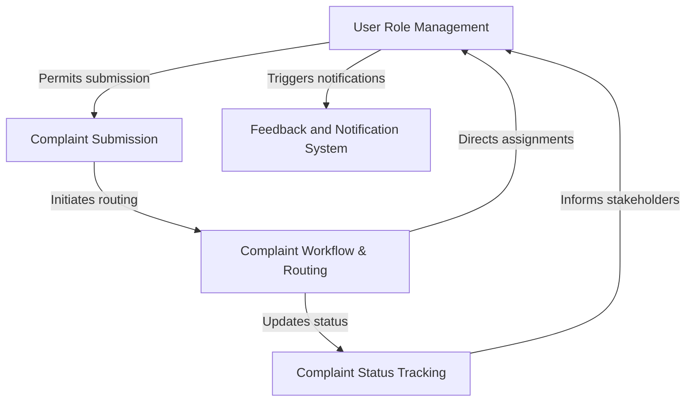

# Tutorial: Complaint_project

This project is an *Automated Complaint Management System* designed to help citizens report community issues easily. Once a complaint is submitted, the system ensures it reaches the **right authority** quickly for **resolution**. It also keeps the citizen *informed* about the complaint's progress and final feedback through **SMS notifications**.

## Visual Overview

## Chapters

1. [User Role Management
](01_user_role_management_.md)
2. [Complaint Submission
](02_complaint_submission_.md)
3. [Complaint Workflow & Routing
](03_complaint_workflow___routing_.md)
4. [Complaint Status Tracking
](04_complaint_status_tracking_.md)
5. [Feedback and Notification System
](05_feedback_and_notification_system_.md)
